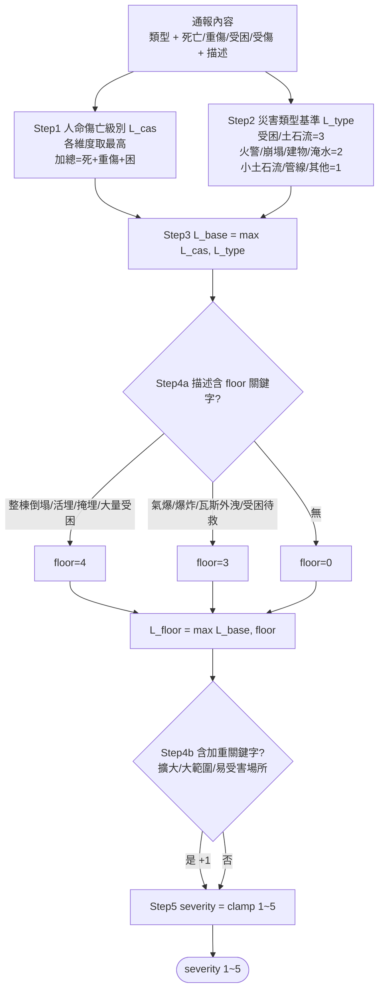

# 嚴重程度（severity）分級規則說明

本文件說明災情通報系統中，`severity`（1~5，1=最輕微、5=最嚴重）的分級規則、設計理由、
依據強度，以及實作與測試位置。

> **實作位置**：規則以共用常數 `SEVERITY_RUBRIC` 定義於
> `backend/app/services/llm_service.py`，由首次通報的 `SYSTEM_PROMPT` 與合併後重新萃取的
> `reextract_numbers_from_description()` 共用同一份，避免兩把尺漂移。

---

## 1. 設計決策

本版規則的三個定調：

| 面向 | 決策 | 說明 |
|------|------|------|
| 判斷機制 | **維持 LLM 推斷** | severity 由 AI 依本 rubric 即時判斷，**不詢問使用者**；即使使用者主動宣稱嚴重程度，仍以本規則為準。 |
| 校準基準 | **貼近民眾逐案通報規模** | 讓 1~5 級在民眾實際會通報的規模（多為個位數傷亡）內均勻分布，利於儀表板排序與分流。 |
| 評分因子 | **傷亡數字 + 災害類型 + 描述關鍵字** | 三者組成五步決策程序。 |

判斷輸入為結構化欄位 `casualties`（死亡）、`injured`（受傷總數，含重傷）、
`severe_injured`（受傷者中的重傷數，為 `injured` 子集）、`trapped`（受困），
加上 `disaster_type`（災害類型）與 `description`（描述文字）。

---

## 2. 五步分級規則（rubric）

全程「命中最高者為準」，最後夾在 [1, 5]。

### Step 1　人命傷亡級別 `L_cas`
各維度分別取可達的最高級，再取最大；**「加總」= 死亡 + 重傷 + 受困**（不含輕傷）。

| 級別 | 死亡 | 重傷 | 受困 | 受傷(injured) | 加總 |
|------|------|------|------|---------------|------|
| 5 | ≥3 | ≥8 | ≥8 | — | ≥15 |
| 4 | 1–2 | 3–7 | 3–7 | — | 8–14 |
| 3 | 0 | 1–2 | 1–2 | ≥5 | 3–7 |
| 2 | 0 | 0 | 0 | 1–4 | 1–2 |
| 1 | 0 | 0 | 0 | 0 | 0 |

> 設計理由：把 `severe_injured`（重傷）與 `trapped`（受困）加重計入「加總」，
> 一般 `injured`（輕傷）只影響到第 2~3 級，使「有人命立即危險」的事件必然高於「多人輕傷」。
> 這也是系統要分開收集重傷人數的用途。

### Step 2　災害類型基準 `L_type`（floor）
反映事件本質風險，即使 0 傷亡也有此下限：

| 基準 | 災害類型 |
|------|---------|
| 3 | `trapped`（人員受困）、`landslide`（土石流） |
| 2 | `fire`（火警）、`road_collapse`（路段崩塌）、`building_damage`（建物受損）、`flooding`（淹水） |
| 1 | `small_landslide`（小型土石流）、`utility_damage`（管線/電力受損）、`other`（其他） |

### Step 3　取基準級別
```
L_base = max(L_cas, L_type)
```
兩維度是不同角度描述同一事件，取 max 而非相加以免灌水。

### Step 4　描述關鍵字調整
僅依民眾「明確描述」判斷，**只加不減**，不得從模糊措辭臆測。

- **Step 4a　floor 關鍵字**（floor4 優先於 floor3）：
  - 「整棟倒塌 / 活埋 / 掩埋 / 大量受困」→ 至少 **4**
  - 「氣爆 / 爆炸 / 瓦斯外洩 / 受困待救 / 無法脫困」→ 至少 **3**
  - `L_floor = max(L_base, floor)`
- **Step 4b　加重 +1**（整體最多 +1）：描述含下列任一即整體 +1——
  - 「持續擴大 / 延燒 / 蔓延 / 失控 / 無法控制」
  - 「大範圍 / 多處 / 整條路 / 數十戶」
  - 「醫院 / 學校 / 養護機構 / 幼兒 / 行動不便」

### Step 5　夾擠
```
severity = clamp(結果, 1, 5)   # 取 1~5 的整數
```
與 DB 約束（`disaster_event.py` 的 `CheckConstraint("severity >= 1 AND severity <= 5")`）
及 schema（`llm_tools.py` 的 `ge=1, le=5`）一致。

---

## 2.5　判斷流程圖



**逐步範例**：火警、5 人受傷其中 2 人重傷、火勢延燒
→ Step1：重傷 1–2 → `L_cas=3`；Step2：fire → `L_type=2`；Step3：`L_base=3`；
Step4a：無 floor 關鍵字；Step4b：「延燒」→ +1；Step5：**severity=4**。

---

## 3. 為什麼改（校準理由）

舊版規則直接沿用《災害緊急通報作業規定》**附表二**的「死亡≥10 / 死傷合計≥30」門檻外推。
查證附表二後發現兩個問題：

1. **附表二是「國家通報升級層級」，不是嚴重度量表**。它的甲/乙/丙級只決定「災情要往上通報到
   哪一層」——甲級通報行政院、乙級通報內政部消防署、丙級通報地方消防局；且**分災種、多為
   情境式描述**（例如震災甲乙級判定文字幾乎相同），並無跨災種通用的傷亡嚴重度階梯。
2. **校準層級錯誤**。附表二門檻是為全國性重大災害設計（死亡≥10 才達最高的甲級）。本系統是
   民眾**逐案**通報 + 儀表板分流，實際通報多為個位數傷亡；若沿用國家門檻，幾乎所有事件都會
   擠在 1~2 級，分級失去鑑別度。

因此本版**改以民眾通報常見規模校準**，但保留附表二中反覆出現的「死亡累積 → 最高通報層級」
序位精神（死亡在本 rubric 中亦為最強升級因子）。

---

## 4. 依據強度總結（誠實揭露）

| 部分 | 依據強度 |
|------|----------|
| 「死亡累積 → 最高級」的序位 | ✅ 有依據：附表二中**土石流（死亡≥10 達甲級）、陸上交通、海難**均反覆出現「死亡≥10 = 最高通報層級」 |
| Step 1 各級的具體人數門檻（重傷/受困 3–7、加總≥15 等） | ⚠️ 本研究自訂：為貼近民眾通報規模而校準，無附表二明文對應 |
| Step 2 災害類型基準（floor） | ⚠️ 本研究設計之啟發式，無明文依據 |
| Step 4 關鍵字 floor / +1 加權 | ⚠️ 本研究設計之啟發式，無明文依據 |

> **論文定位**：本 1~5 級為**系統內部相對嚴重度指標**，用於儀表板分流排序，
> **不等同**官方甲/乙/丙級通報層級。類型基準與關鍵字加權為本研究設計之啟發式。

---

## 5. 實作與測試位置

| 用途 | 位置 |
|------|------|
| 線上規則（LLM 實際依循） | `backend/app/services/llm_service.py` 的 `SEVERITY_RUBRIC` 常數 |
| 確定性 oracle（規則的可測規格書） | `backend/tests/test_severity_rubric.py` 的 `severity_from_rubric()` 與 `TYPE_FLOOR` |
| 真實 LLM 擷取 E2E | `backend/tests/e2e/test_e2e_report_extraction.py` + `e2e_report_cases.json`（需 `RUN_LLM_EVALS=1`） |

`severity_from_rubric()` 是五步規則的純函式實作，**不掛在系統執行路徑**上——線上分級仍由
LLM 依 prompt 內的 `SEVERITY_RUBRIC` 推斷；此函式僅作測試 oracle 與論文標準答案產生器。

---

## 6. 驗證結果

**確定性 oracle**：`test_severity_rubric.py` 40 筆參數化案例（21 筆級距代表值 + 19 筆臨界值
off-by-one）＋ 2 筆性質測試（全範圍不變式、重傷夾擠）全數通過。

**真實 LLM 擷取 E2E**（`RUN_LLM_EVALS=1`）：`e2e_report_cases.json` 共 24 筆通報輸入
（A1–A19 涵蓋 9 種災害類型 × severity 1~5，C1–C5 邊界情境）全數通過。代表結果：

| 通報輸入情境 | LLM 擷取 | severity | rubric 依據 |
|--------------|----------|----------|------------|
| 工廠火警、持續延燒、5 傷其中 2 重傷 (A14) | `injured=5, severe_injured=2, casualties=0` | 4 | L_cas 3 +「延燒」+1 |
| 土石流沖入民宅致 1 死 (A16) | `casualties=1` | 4 | 死亡 1–2 → L_cas 4 |
| 大範圍淹水及腰、無傷亡 (A11) | `casualties=0, injured=0` | 3 | type 2 +「大範圍」+1 |
| 大樓整棟倒塌、3 死 2 受困 (A19) | `casualties=3, trapped=2` | 5 | 死亡≥3 → L_cas 5 |

> 完整 24 筆與邊界情境說明見 [e2e-test-data.md](./e2e-test-data.md)。
> 註：eval 輸入須資訊齊全（含地點門牌、時間、姓名電話與明確傷亡人數），否則 LLM 會依對話
> 協定改為追問而非提交。

---

## 7. 維護建議

- **改門檻時需同步三處**，以免規格與行為/測試對不上：
  1. `SEVERITY_RUBRIC`（`llm_service.py`）— prompt 文字，**改變 LLM 實際行為**
  2. `TYPE_FLOOR` 與門檻邏輯（`test_severity_rubric.py`）— **測試 oracle 的期望值**
  3. 本文件
- severity 為 LLM 即時推斷，非確定性；回歸請跑 `test_severity_rubric.py`（不需 API），
  端到端複驗用 `RUN_LLM_EVALS=1 pytest tests/e2e -m llm -s`。
- 建議累積實際通報資料後，回頭校準 Step 1 各級門檻與 Step 2 類型基準。
